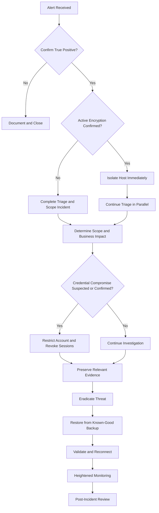

# Incident Response Runbook: Ransomware via Phishing-Delivered Payload

## Overview

This project demonstrates a structured incident response process for a simulated ransomware infection originating from a phishing-delivered malicious document.

The scenario focuses on detection, triage, containment, evidence preservation, eradication, recovery, and post-incident review in a realistic enterprise environment.

## Scenario

A finance workstation begins generating abnormal SMB write activity against a shared network drive. Endpoint telemetry indicates that a malicious macro-enabled document launched PowerShell shortly before encryption activity began.

The incident is treated as a high-impact security event due to active encryption of business-critical shared data and the potential for lateral movement.

## Skills Demonstrated

- Incident response
- SIEM and EDR analysis
- Ransomware triage
- Evidence preservation
- Containment and recovery decision-making
- Windows endpoint security
- Network and SMB troubleshooting
- Security documentation
- Risk and severity assessment

## Framework

The runbook uses a practical incident-response workflow while incorporating current guidance from NIST SP 800-61r3 and the NIST Cybersecurity Framework 2.0.

## Project Contents

- [`RUNBOOK.md`](RUNBOOK.md) — Full incident response runbook
- [`evidence/`](evidence/) — Supporting scenario evidence and incident artifacts
- [`evidence/scenario-timeline.md`](evidence/scenario-timeline.md) — Simulated incident timeline with evidence sources and response milestones
## Project Objective

The goal of this project is to demonstrate how technical troubleshooting skills can be applied to cybersecurity incident response, including analyzing evidence, making containment decisions, assessing business impact, and documenting a repeatable response process.

## Incident Response Flow

