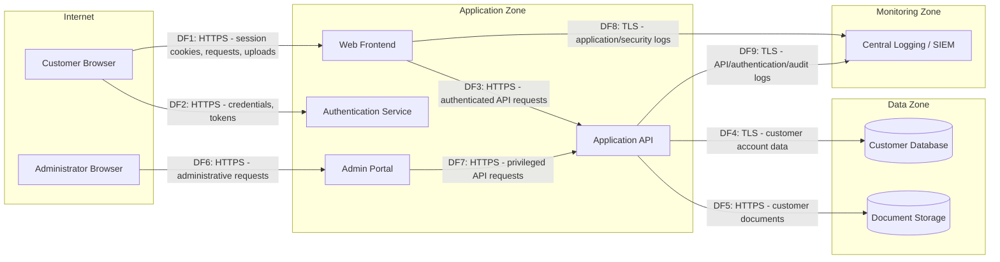

# Data Flow Diagram

## Trust Boundaries

- **TB1 — Internet to Application Boundary**
  - separates customer/admin browsers from public and restricted application services

- **TB2 — Application to Data Boundary**
  - separates application services from customer data and document storage

- **TB3 — Application to Monitoring Boundary**
  - separates production application services from centralized logging and SIEM infrastructure
